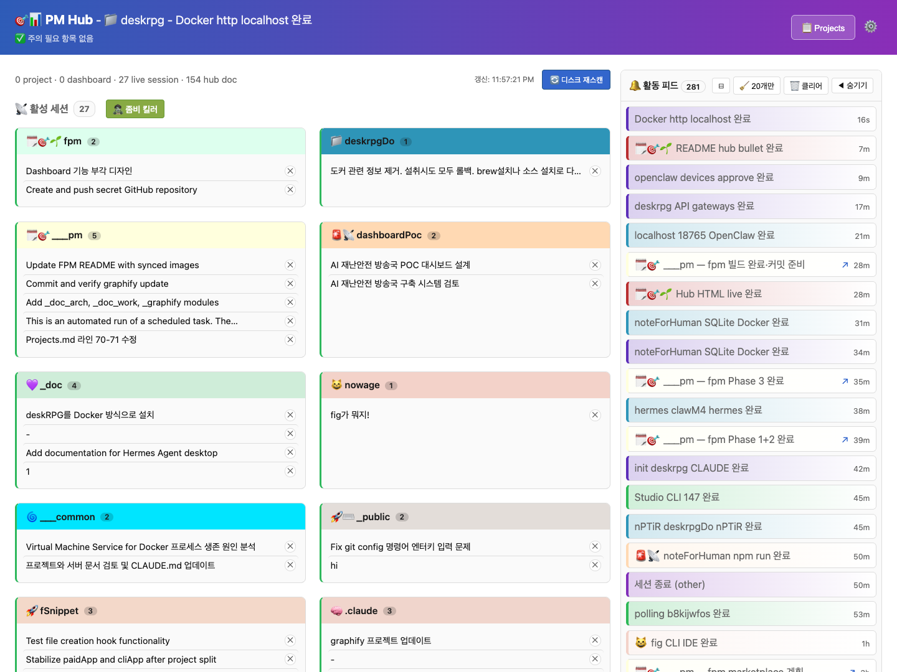
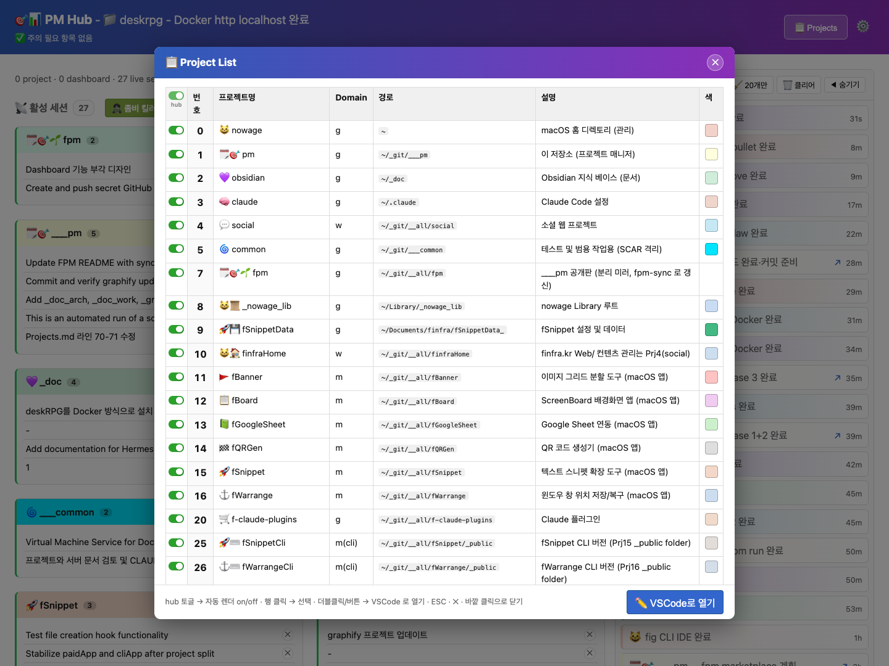

# fpm

> ### 🎯 여러 프로젝트·세션을 넘나드는 Claude Code 작업을 **하나의 대시보드로 통합**
>
> 어느 세션의 어떤 응답인지 추적하고, 결과를 **텍스트·HTML 중 골라** 보며, 잦은 질문은 **폼으로 모아** 처리하는 **멀티세션 관제 시스템**.

번호 인덱스로 프로젝트 디렉토리(`cdf`)와 SSH 서버(`sshf`)에 빠르게 접근하는 zsh 함수군 + 작업을 HTML 로 렌더링하는 **hub** 서버 + Claude Code SCAR(Skills/Commands/Agents/Rules) 모음.

> 듀얼 라이선스: 개인·비영리 무료 / 기업 유료. [LICENSE](LICENSE) · [COMMERCIAL.md](COMMERCIAL.md)

## 핵심 기능

* **cdf** — 프로젝트 번호로 즉시 `cd`, 복수 지정 시 iTerm2 분할
* **sshf** — `Servers.md` 의 id/name/alias 로 SSH 접속, 복수 지정 시 분할
* **hub** — 매 작업 응답을 HTML 문서로 렌더하여 브라우저에 표시. 멀티 프로젝트 대시보드(활성 세션 보드·문서 아카이브·실시간 활동 피드)·양방향 Q&A 폼 제공 (`services/hub/`)
* **board** — 장시간 작업을 tmux runner 로 모니터링하며 별도 Firefox 탭에 진행률을 실시간 동기. 채팅 스크롤 폭주 없이 관제하고 완료 시 자동 알림 (`..board <주제>`, hub Mode C dashboard agent)
* **SCAR** — 프로젝트 관리용 Claude Code 커맨드/스킬/에이전트/룰 ([SCAR 개념 정의 →](https://finfra.kr/jg/2026/04/20/scar_define/))

## 설치

```bash
git clone https://github.com/finfra/fpm.git ~/_git/fpm
cd ~/_git/fpm
bash install.sh
source ~/.zshrc
```

자세한 설정은 [INSTALL.md](INSTALL.md) 참조.

## 사용 예

```bash
cdf            # 전체 프로젝트 목록
cdfc 2         # 경로를 클립보드에 복사
cdfv 0 1 2     # VS Code 로 열기 (복수)

sshf           # 서버 목록
sshf 3         # id=3 서버 접속
sshf 1 2 3     # 다중 서버 → iTerm2 분할
```

## hub 대시보드

`hub` 서버(port 9876)가 모든 프로젝트의 Claude Code 작업을 단일 웹 대시보드(`http://127.0.0.1:9876/hub`)로 통합한다. 탭 전환 없이 동시 진행 세션을 한 화면에서 관제한다.





| 기능              | 설명                                                                             |
| :---------------- | :------------------------------------------------------------------------------- |
| 활성 세션 보드    | 프로젝트별 색상 카드로 동시 세션·최근 프롬프트 표시, 좀비 킬러로 죽은 세션 정리  |
| hub 문서 아카이브 | 매 응답을 HTML 로 렌더·축적, 프로젝트 필터·최신 N개만 남기기로 부피 관리         |
| 실시간 활동 피드  | 이슈 종결·세션 종료 등 이벤트를 SSE 로 즉시 push (폴링 없음)                     |
| 프로젝트 리스트   | `Projects.md`(SSOT) 시각화 — 번호·도메인·경로, per-project hub 토글, VSCode 열기 |
| 양방향 Q&A 폼     | `AskUserQuestion` 을 HTML 폼으로 제시하고 응답 자동 회수                         |

내부: Python stdlib HTTP+SSE 단일 daemon, `127.0.0.1` 바인딩, token 인증. 상세: [services/hub/README.md](services/hub/README.md)

## board — 장시간 작업 라이브 대시보드

빌드·배포·큐 처리처럼 오래 걸리는 작업의 진행률을 채팅 스크롤을 어지럽히지 않고 별도 Firefox 탭에 실시간 동기하는 hub Mode C dashboard agent. tmux `pm` 세션의 `_<주제>` window 가 대시보드 1개 단위가 되어 background runner 가 주기적으로 데이터를 갱신한다. main turn 은 차단되지 않아 사용자는 곧바로 다음 작업을 이어갈 수 있다.

```bash
..board <주제>              # 라이브 대시보드 시작 (window 잔존, 로그 보존)
..board <주제> --auto-kill # 완료 후 tmux window 자동 종료
```

| 모드            | 구성                                     | 용도                                              |
| :-------------- | :--------------------------------------- | :------------------------------------------------ |
| 순수 모니터링   | runner 1                                 | 외부 명령 주기 실행·진행률 시각화                 |
| 큐 오케스트레이션 | supervisor + queue-runner + worker N    | 이슈·서브이슈를 DAG 큐로 등록, 위상 순서·동시성 처리 |

finite 작업(worker_pid·큐)은 완료 시 main 세션의 백그라운드 폴러가 소요시간·결과·산출물을 채팅으로 자동 알림한다. hub(단발 응답·다단계 질문)와 board(장시간 모니터링)는 책임이 분리되어 있다.

## 구조

| 경로                                 | 설명                                                   |
| :----------------------------------- | :----------------------------------------------------- |
| `shell/fpm-functions.zsh`            | cdf·sshf 셸 함수군 (설치 페이로드)                     |
| `projects/`                          | 번호→경로 매핑 (개인 — gitignore, install 이 스캐폴드) |
| `Projects_org.md` / `Servers_org.md` | 운영 필수 파일 예제 (install 이 실파일 배치)           |
| `services/hub/`                      | hub HTTP+SSE 서버 (Python stdlib)                      |
| `.claude/`                           | Claude Code SCAR                                       |
| `mcp/`                               | MCP 서버 (hub/pm 기능 노출)                            |
| `keyboard-maestro/`                  | Keyboard Maestro 매크로 + 안내                         |

## Keyboard Maestro 연동 (선택)

| 매크로       | 설명                                                           |
| :----------- | :------------------------------------------------------------- |
| `cdf__base`  | cdf 프로젝트 목록 표시 → 번호 입력 → 해당 디렉토리 이동 (기반) |
| `cdfv_ff`    | 핫키로 Finder/iTerm 컨텍스트에서 cdf 이동                      |
| `cdf_claude` | cdf 이동 후 Claude Code(`cc`) 자동 실행                        |

3개 매크로 모두 [keyboard-maestro/cdf.kmmacros](keyboard-maestro/cdf.kmmacros) 한 파일에 export 됨 (그룹 `3._FinderOpen_Folder`).

상세: [keyboard-maestro/README.md](keyboard-maestro/README.md)

## 더 읽기 (finfra.kr/jg 블로그)

fpm 의 설계 개념을 다룬 글 모음.

| 주제                            | 링크                                                             |
| :------------------------------ | :--------------------------------------------------------------- |
| SCAR — 공용 정의                | <https://finfra.kr/jg/2026/04/20/scar_define/>                   |
| Claude Code Harness 아키텍처    | <https://finfra.kr/jg/2026/04/21/harness_arch/>                  |
| nPTiR — 공용 정의               | <https://finfra.kr/jg/2026/04/20/nptir_define/>                  |
| Claude Code `..htm` (HTML 출력) | <https://finfra.kr/jg/2026/05/17/claude-code-html-output-htm-2/> |


## 라이선스

[PolyForm Noncommercial 1.0.0](LICENSE) — 개인·비영리 무료. 기업·상업적 사용은 [상용 라이선스](COMMERCIAL.md) 필요.
