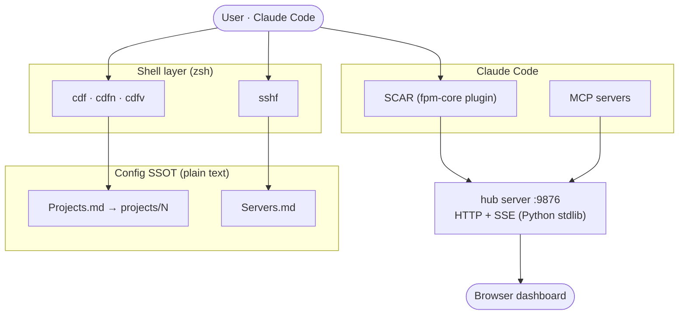

> 🌐 **English** | [한국어](README_ko.md)

# fpm

> ### 🎯 Unify Claude Code work across many projects and sessions into **a single dashboard**
>
> A **multi-session control system** that tracks which response came from which session, lets you view results in **either text or HTML**, and collects frequent questions into **forms**.

A set of zsh functions for fast number-indexed access to project directories (`cdf`) and SSH servers (`sshf`) + a **hub** server that renders work into HTML + a collection of Claude Code SCAR (Skills/Commands/Agents/Rules).

> Dual license: free for personal/non-commercial use / paid for enterprises. [LICENSE](LICENSE) · [Commercial License](COMMERCIAL.md)

## Quick Start

Install with a single line — no clone needed:

```bash
curl -fsSL https://raw.githubusercontent.com/Finfra/fpm/main/sh/bootstrap.sh | sh
source ~/.zshrc
```

Then jump to any project by number and self-update anytime:

```bash
cdf 11        # cd to project 11
cdf 11-16     # range → iTerm2 split
fpm update    # pull latest + refresh SCAR plugin
```

> Shell-only (cdf/sshf) needs nothing beyond zsh. SCAR/hub/dashboard pull in extra tools — see [Requirements](#requirements).
> Installing from a private mirror? Use `gh api -H "Accept: application/vnd.github.raw" repos/Finfra/fpm/contents/sh/bootstrap.sh | sh` (needs `gh` CLI auth).

## Demo


## Key Features

* **cdf** — instantly `cd` by project number; splits iTerm2 when multiple are given. Supports ranges (`11-16`), command forwarding (`--- cmd`), and heredoc
* **cdfn / cdfvn** — navigate by **partial name match** instead of number (`cdfn snippet`). Shows a picker when multiple match
* **sshf** — SSH by id/name/alias from `Servers.md`; splits when multiple are given
* **hub** — renders every work response into an HTML document and shows it in the browser. Provides a multi-project dashboard (active session board · document archive · real-time activity feed) and a two-way Q&A form (`services/hub/`)
* **SCAR** — Claude Code commands/skills/agents/rules for project management ([SCAR concept definition →](https://finfra.kr/jg/2026/04/20/scar_define/))

## Requirements

Configuration is based on plain text (`projects/<number>`) and Markdown (`Projects.md`/`Servers.md`) rather than YAML, so no separate config parser is needed. However, running it requires the following runtime tools per feature.

| Tool                            | Necessity                  | Purpose                                                       |
| :------------------------------ | :------------------------- | :----------------------------------------------------------- |
| **zsh**                         | Required                   | cdf/sshf shell functions                                     |
| **macOS**                       | Recommended                | iTerm2 split · Finder · clipboard (Linux: single `cd`/`ssh` only) |
| **Claude Code CLI** (`claude`)  | Required for SCAR          | Install/run the fpm-core plugin (Skills/Commands/Agents/Rules) |
| **Node.js** (npm)               | Required for SCAR          | Basis for installing Claude Code CLI · running some MCP servers (npx) |
| **Python 3**                    | Required for hub · MCP     | hub dashboard server (port 9876) · MCP servers (`services/hub/` · `mcp/`) |
| **tmux**                        | Required for dashboard · cdft | tmux pm session management · dashboard agent runner       |
| iTerm2                          | Optional                   | cdf multi-pane split                                         |
| VS Code + `code` CLI            | Optional                   | cdfv / cdfvn                                                 |
| Keyboard Maestro (paid)         | Optional                   | Macro integration                                           |

> Using only the shell functions (cdf/sshf) requires **no dependency beyond zsh**. SCAR, hub, and dashboard each require the tools above to work. `sh/install.sh` skips only the SCAR install when the `claude` CLI is absent and completes the shell install normally.

## Installation

**Recommended — one-line remote install** (clones to `~/.fpm`, idempotent):

```bash
curl -fsSL https://raw.githubusercontent.com/Finfra/fpm/main/sh/bootstrap.sh | sh
source ~/.zshrc
```

**Manual — clone first:**

```bash
git clone https://github.com/Finfra/fpm.git ~/_git/fpm
cd ~/_git/fpm
bash sh/install.sh
source ~/.zshrc
```

Manage the install afterward with the `fpm` command: `fpm update` (branch latest) · `fpm upgrade` (latest release tag) · `fpm version` · `fpm uninstall`. For detailed configuration, see [INSTALL.md](INSTALL.md).

## Usage Examples

```bash
cdf            # full project list
cdf 11         # go to project 11
cdf 11 12 13   # multiple → iTerm2 split
cdf 11-16      # range expansion (11 12 13 14 15 16) → split
cdf 11 data    # go to the data/ subfolder under project 11
cdf 11 --- ls  # run a command after moving (delimiter is three dashes ---)
cdf 11 12 <<EOF   # multi-line command via heredoc
git status
EOF

cdfn snippet   # navigate by partial name match (when number is unknown). Also matches Korean names and paths
cdfn 커먼      # Korean name match — shows a picker when multiple match
cdfvn snippet  # partial name match → open in VS Code

cdfc 2         # copy the path to the clipboard
cdfv 0 1 2     # open in VS Code (multiple)

sshf           # server list
sshf 3         # connect to server id=3
sshf 1 2 3     # multiple servers → iTerm2 split
```

## hub Dashboard

The `hub` server (port 9876) unifies Claude Code work from all projects into a single web dashboard (`http://127.0.0.1:9876/hub`). It lets you monitor concurrently running sessions on one screen without switching tabs.


| Feature                  | Description                                                                       |
| :----------------------- | :------------------------------------------------------------------------------- |
| Active session board     | Shows concurrent sessions · recent prompts as per-project colored cards; a zombie killer cleans up dead sessions |
| hub document archive     | Renders and accumulates every response as HTML; manages volume with project filters · keeping only the latest N |
| Real-time activity feed  | Pushes events such as issue closing · session end immediately via SSE (no polling) |
| Project list             | Visualizes `Projects.md` (SSOT) — number · domain · path, per-project hub toggle, open in VSCode |
| Two-way Q&A form         | Presents `AskUserQuestion` as an HTML form and automatically collects the response |

Internals: a single Python stdlib HTTP+SSE daemon, bound to `127.0.0.1`, with token authentication. Details: [services/hub/README.md](services/hub/README.md)

## Architecture



* **Shell layer** resolves a project number/name to a path from the `Projects.md`/`Servers.md` SSOT — no daemon, no parser.
* **SCAR + MCP** drive Claude Code; work responses are pushed to the **hub** server.
* **hub** renders every response into HTML and streams live events (SSE) to the browser dashboard.

## Structure

| Path                                 | Description                                            |
| :----------------------------------- | :----------------------------------------------------- |
| `sh/`                                | cdf · sshf shell functions + `fpm.sh` bootstrap (install payload) |
| `projects/`                          | number→path mapping (personal — gitignored, scaffolded by install) |
| `Projects_org.md` / `Servers_org.md` | examples of required operating files (install places the real files) |
| `services/hub/`                      | hub HTTP+SSE server (Python stdlib)                    |
| `.claude/`                           | Claude Code SCAR                                       |
| `mcp/`                               | MCP servers (expose hub/pm features)                   |
| `keyboard-maestro/`                  | Keyboard Maestro macros + guide                        |

## Keyboard Maestro Integration (optional)

| Macro                                   | Description                                          |
| :-------------------------------------- | :--------------------------------------------------- |
| `iterm - input num for broadcast input` | iTerm2 simultaneous input to multiple panes → move each to its directory with cdf |
| `ff_cdf`                                | Finder/iTerm navigation, paste path otherwise        |

Details: [keyboard-maestro/README.md](keyboard-maestro/README.md)

## Further Reading (finfra.kr/jg blog)

A collection of posts covering fpm's design concepts.

| Topic                            | Link                                                            |
| :------------------------------- | :--------------------------------------------------------------- |
| SCAR — common definition         | <https://finfra.kr/jg/2026/04/20/scar_define/>                   |
| Claude Code Harness architecture | <https://finfra.kr/jg/2026/04/21/harness_arch/>                  |
| nPTiR — common definition        | <https://finfra.kr/jg/2026/04/20/nptir_define/>                  |
| Claude Code `..htm` (HTML output) | <https://finfra.kr/jg/2026/05/17/claude-code-html-output-htm-2/> |

## License

[PolyForm Noncommercial 1.0.0](LICENSE) — free for personal/non-commercial use. Enterprise/commercial use requires a [commercial license](COMMERCIAL.md).
