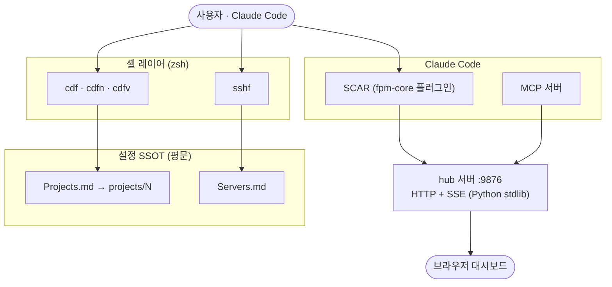

> 🌐 [English](README.md) | **한국어**

# fpm

> ### 🎯 여러 프로젝트·세션을 넘나드는 Claude Code 작업을 **하나의 대시보드로 통합**
>
> 어느 세션의 어떤 응답인지 추적하고, 결과를 **텍스트·HTML 중 골라** 보며, 잦은 질문은 **폼으로 모아** 처리하는 **멀티세션 관제 시스템**.

번호 인덱스로 프로젝트 디렉토리(`cdf`)와 SSH 서버(`sshf`)에 빠르게 접근하는 zsh 함수군 + 작업을 HTML 로 렌더링하는 **hub** 서버 + Claude Code SCAR(Skills/Commands/Agents/Rules) 모음.

> 듀얼 라이선스: 개인·비영리 무료 / 기업 유료. [LICENSE](LICENSE) · [COMMERCIAL_ko.md](COMMERCIAL_ko.md)

## 빠른 시작

클론 없이 한 줄로 설치:

```bash
curl -fsSL https://raw.githubusercontent.com/Finfra/fpm/main/sh/bootstrap.sh | sh
source ~/.zshrc
```

이후 번호로 프로젝트 점프 + 셀프 업데이트:

```bash
cdf 11        # 프로젝트 11 로 cd
cdf 11-16     # 범위 → iTerm2 분할
fpm update    # 최신 pull + SCAR 플러그인 갱신
```

> 셸만(cdf/sshf) 쓰면 zsh 외 의존성 없음. SCAR/hub/dashboard 는 추가 도구 필요 — [요구 사항](#요구-사항) 참조.
> 비공개 미러 설치 시: `gh api -H "Accept: application/vnd.github.raw" repos/Finfra/fpm/contents/sh/bootstrap.sh | sh` (`gh` CLI 인증 필요).

## 데모


## 핵심 기능

* **cdf** — 프로젝트 번호로 즉시 `cd`, 복수 지정 시 iTerm2 분할. 범위(`11-16`)·명령 전달(`--- cmd`)·heredoc 지원
* **cdfn / cdfvn** — 번호 대신 **이름 부분일치**로 이동(`cdfn snippet`). 다수 매치 시 선택창
* **sshf** — `Servers.md` 의 id/name/alias 로 SSH 접속, 복수 지정 시 분할
* **hub** — 매 작업 응답을 HTML 문서로 렌더하여 브라우저에 표시. 멀티 프로젝트 대시보드(활성 세션 보드·문서 아카이브·실시간 활동 피드)·양방향 Q&A 폼 제공 (`services/hub/`)
* **SCAR** — 프로젝트 관리용 Claude Code 커맨드/스킬/에이전트/룰 ([SCAR 개념 정의 →](https://finfra.kr/jg/2026/04/20/scar_define/))

## 요구 사항

설정은 YAML 이 아닌 평문 텍스트(`projects/<번호>`)·마크다운(`Projects.md`/`Servers.md`) 기반이라 별도 설정 파서가 필요 없다. 다만 구동에는 아래 런타임 도구가 기능별로 필요하다.

| 도구                            | 필요도            | 용도                                                          |
| :------------------------------ | :---------------- | :------------------------------------------------------------ |
| **zsh**                         | 필수              | cdf/sshf 셸 함수군                                            |
| **macOS**                       | 권장              | iTerm2 분할·Finder·클립보드 (Linux 는 단일 `cd`/`ssh` 만)     |
| **Claude Code CLI** (`claude`)  | SCAR 사용 시 필수 | fpm-core 플러그인(Skills/Commands/Agents/Rules) 설치·실행     |
| **Node.js** (npm)               | SCAR 사용 시 필수 | Claude Code CLI 설치·일부 MCP 서버(npx) 구동 기반             |
| **Python 3**                    | hub·MCP 사용 시 필수 | hub 대시보드 서버(port 9876)·MCP 서버 (`services/hub/`·`mcp/`) |
| **tmux**                        | dashboard·cdft 사용 시 필수 | tmux pm 세션 관리·dashboard 에이전트 runner            |
| iTerm2                          | 선택              | cdf 다중 패널 분할                                            |
| VS Code + `code` CLI            | 선택              | cdfv / cdfvn                                                  |
| Keyboard Maestro (유료)         | 선택              | 매크로 연동                                                   |

> 셸 함수(cdf/sshf)만 쓰면 **zsh 외 의존성 없음**. SCAR·hub·dashboard 는 각각 위 도구가 있어야 동작한다. `sh/install.sh` 는 `claude` CLI 부재 시 SCAR 설치만 건너뛰고 셸 설치는 정상 완료한다.

## 설치

**권장 — 원격 원라인 설치** (`~/.fpm` 에 클론, 멱등):

```bash
curl -fsSL https://raw.githubusercontent.com/Finfra/fpm/main/sh/bootstrap.sh | sh
source ~/.zshrc
```

**수동 — 클론 먼저:**

```bash
git clone https://github.com/Finfra/fpm.git ~/_git/fpm
cd ~/_git/fpm
bash sh/install.sh
source ~/.zshrc
```

설치 후 `fpm` 커맨드로 관리: `fpm update`(브랜치 최신) · `fpm upgrade`(최신 릴리즈 태그) · `fpm version` · `fpm uninstall`. 자세한 설정은 [INSTALL_ko.md](INSTALL_ko.md) 참조.

## 사용 예

```bash
cdf            # 전체 프로젝트 목록
cdf 11         # 11번 프로젝트로 이동
cdf 11 12 13   # 다중 → iTerm2 분할
cdf 11-16      # 범위 확장(11 12 13 14 15 16) → 분할
cdf 11 data    # 11번 하위 data/ 서브폴더로 이동
cdf 11 --- ls  # 이동 후 명령 실행(구분자는 대시 3개 ---)
cdf 11 12 <<EOF   # heredoc 으로 멀티라인 명령
git status
EOF

cdfn snippet   # 이름 부분일치로 이동(번호 모름 때). 한글명·경로도 매칭
cdfn 커먼      # 한글명 매칭 — 다수 매치 시 선택창
cdfvn snippet  # 이름 부분일치 → VS Code 로 열기

cdfc 2         # 경로를 클립보드에 복사
cdfv 0 1 2     # VS Code 로 열기 (복수)

sshf           # 서버 목록
sshf 3         # id=3 서버 접속
sshf 1 2 3     # 다중 서버 → iTerm2 분할
```

## hub 대시보드

`hub` 서버(port 9876)가 모든 프로젝트의 Claude Code 작업을 단일 웹 대시보드(`http://127.0.0.1:9876/hub`)로 통합한다. 탭 전환 없이 동시 진행 세션을 한 화면에서 관제한다.


| 기능              | 설명                                                                             |
| :---------------- | :------------------------------------------------------------------------------- |
| 활성 세션 보드    | 프로젝트별 색상 카드로 동시 세션·최근 프롬프트 표시, 좀비 킬러로 죽은 세션 정리  |
| hub 문서 아카이브 | 매 응답을 HTML 로 렌더·축적, 프로젝트 필터·최신 N개만 남기기로 부피 관리         |
| 실시간 활동 피드  | 이슈 종결·세션 종료 등 이벤트를 SSE 로 즉시 push (폴링 없음)                     |
| 프로젝트 리스트   | `Projects.md`(SSOT) 시각화 — 번호·도메인·경로, per-project hub 토글, VSCode 열기 |
| 양방향 Q&A 폼     | `AskUserQuestion` 을 HTML 폼으로 제시하고 응답 자동 회수                         |

내부: Python stdlib HTTP+SSE 단일 daemon, `127.0.0.1` 바인딩, token 인증. 상세: [services/hub/README.md](services/hub/README.md)

## 아키텍처



* **셸 레이어** — 번호/이름을 `Projects.md`/`Servers.md` SSOT 경로로 해석. daemon·파서 불필요.
* **SCAR + MCP** — Claude Code 구동, 작업 응답을 **hub** 서버로 push.
* **hub** — 매 응답을 HTML 로 렌더 + 실시간 이벤트(SSE)를 브라우저 대시보드로 스트리밍.

## 구조

| 경로                                 | 설명                                                   |
| :----------------------------------- | :----------------------------------------------------- |
| `sh/`                                | cdf·sshf 셸 함수군 + `fpm.sh` 부트스트랩 (설치 페이로드) |
| `projects/`                          | 번호→경로 매핑 (개인 — gitignore, install 이 스캐폴드) |
| `Projects_org.md` / `Servers_org.md` | 운영 필수 파일 예제 (install 이 실파일 배치)           |
| `services/hub/`                      | hub HTTP+SSE 서버 (Python stdlib)                      |
| `.claude/`                           | Claude Code SCAR                                       |
| `mcp/`                               | MCP 서버 (hub/pm 기능 노출)                            |
| `keyboard-maestro/`                  | Keyboard Maestro 매크로 + 안내                         |

## Keyboard Maestro 연동 (선택)

| 매크로                                  | 설명                                                 |
| :-------------------------------------- | :--------------------------------------------------- |
| `iterm - input num for broadcast input` | iTerm2 다중 패널 동시 입력 → cdf 로 각 디렉토리 이동 |
| `ff_cdf`                                | Finder/iTerm 이동, 그 외 경로 붙여넣기               |

상세: [keyboard-maestro/README.md](keyboard-maestro/README.md)

## 더 읽기 (finfra.kr/jg 블로그)

fpm 의 설계 개념을 다룬 글 모음.

| 주제                            | 링크                                                             |
| :------------------------------ | :--------------------------------------------------------------- |
| SCAR — 공용 정의                | <https://finfra.kr/jg/2026/04/20/scar_define/>                   |
| Claude Code Harness 아키텍처    | <https://finfra.kr/jg/2026/04/21/harness_arch/>                  |
| nPTiR — 공용 정의               | <https://finfra.kr/jg/2026/04/20/nptir_define/>                  |
| Claude Code `..htm` (HTML 출력) | <https://finfra.kr/jg/2026/05/17/claude-code-html-output-htm-2/> |

## 라이선스

[PolyForm Noncommercial 1.0.0](LICENSE) — 개인·비영리 무료. 기업·상업적 사용은 [상용 라이선스](COMMERCIAL_ko.md) 필요.
