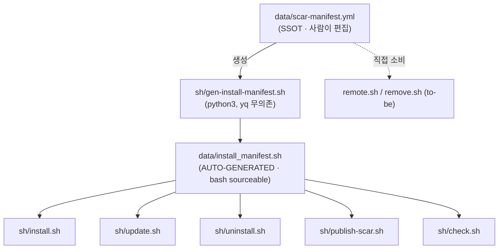

# 개요

`data/scar-manifest.yml` 은 fpm SCAR 가 다른 머신/서버로 배포되는 **두 경로**(플러그인·플랫파일)와
셸 부트스트랩 아티팩트를 한 곳에 모은 단일 진실 원본(SSOT)이다. 본 문서는 그 yml 의 설계 근거,
해결한 버그, 소비 스크립트 계약, 생성 절차를 기술한다. (Issue240)

# 해결한 버그 — 원격 플랫파일 삭제 누락

원격 서버 배포 경로(`data/claude_forNewServer/` → 원격 `~/.claude/`)의 rsync 설치 가이드가
과거 `--delete` 플래그를 쓰지 않았다. rsync 는 기본적으로 **추가·갱신만** 하고 소스에 없는
파일은 건드리지 않으므로, 소스에서 rename·삭제된 SCAR 파일이 원격 서버에 orphan 으로 잔존했다.
이것이 "다른 서버에 SCAR 를 설치/제거/업데이트하는데 해당 파일을 지우지 못하는 현상" 의 근원이다.

해법:

* `payloads.flat_file.rsync_delete: true` — orphan prune 활성
* `payloads.flat_file.protect[]` — `--delete` 시에도 보존할 대상 서버 사용자 데이터(Issue.md·projects/ 등)
* `payloads.flat_file.files[]` — 정밀 삭제·dry-run·검증용 전체 인벤토리

# 배포 2경로

| 경로            | 소스                      | 대상                 | 삭제 의미                                                  |
| :-------------- | :------------------------ | :------------------- | :--------------------------------------------------------- |
| 플러그인        | `plugins/fpm-core/`       | 마켓 → `claude plugin` | `plugin (un)install/update` 가 디렉토리 전체 교체 → orphan 자동 정리(문제 없음) |
| 플랫파일        | `data/claude_forNewServer/` | 원격 `~/.claude/`    | rsync `--delete` 필수 — 미사용 시 orphan 잔존(=원 버그)     |

플러그인 경로는 로컬 머신 표준 설치, 플랫파일 경로는 claude CLI 플러그인이 가용하지 않은
고객/타 서버용이다.

# SSOT 위계 — yml 이 정본, install_manifest.sh 는 파생



* **왜 파생물을 두는가**: installer 는 `yq`·`pyyaml` 무의존이어야 한다(폐쇄망·최소 환경). 따라서
  빌드 타임에 생성기가 yml → bash 투영을 만들어 커밋하고, 설치 시점엔 그 `.sh` 만 source 한다.
* **생성기**: `sh/gen-install-manifest.sh` (python3 + pyyaml, dev 머신에서만 실행)
* **drift 가드**: `bash sh/gen-install-manifest.sh --check` — yml 과 `.sh` 불일치 시 exit 2
* **편집 규칙**: `install_manifest.sh` 를 **직접 고치지 말 것**. yml 수정 → 생성기 재실행 → 커밋.

# 소비 스크립트 계약

| 스크립트                  | 읽는 영역                  | 비고                                            |
| :------------------------ | :------------------------- | :---------------------------------------------- |
| `sh/install.sh`           | shell + payloads.plugin    | 셸 부트스트랩 + 플러그인 멱등 설치              |
| `sh/update.sh`            | payloads.plugin            | git pull(셸) + marketplace/plugin update        |
| `sh/uninstall.sh`         | shell + payloads.plugin    | 셸 블록 제거 + plugin uninstall (마켓 보존)     |
| `sh/publish-scar.sh`      | payloads.plugin            | 소스 → 마켓 발행(rsync --delete)                |
| `sh/check.sh`             | shell + plugin + flat_file | 설치 검증 + SCAR drift 대조 (항목11·12·12-2)    |
| `sh/scar-flatfile-sync.sh` | payloads.flat_file        | 사본을 prj3 원본에서 재생성 + `--check` 표류 게이트 (Issue388) |
| `sh/scar-hooks-check.sh`  | payloads.plugin (`scar.hooks`·`hooks_origin_rel_home`·`hooks_bundle_only`) | 번들 `hooks/` 3방향 대조 — **검사 전용**(동기는 `fpm-bundle-sync.sh`) (Issue412) |
| `scripts/fpm-bundle-sync.sh` | (yml 미참조 — 경로 하드코딩) | 번들 `hooks/`·`commands/`·`agents/`·`services/hub` 의 **유일한 writer**. 라이브(prj3·prj1) → 번들 단방향 |
| `remote.sh` (to-be)       | payloads.flat_file         | 원격 `~/.claude` 플랫파일 배포(rsync_delete + protect) |
| `remove.sh` (to-be)       | payloads.flat_file         | `flat_file.files` 정밀 삭제, `protect` 보존     |

플러그인 경로 스크립트는 `data/install_manifest.sh`(파생) 를 source 한다(무의존). to-be 스크립트는
플랫파일 페이로드가 필요하므로 yml 을 직접 소비한다(dev/원격 모두 python3 또는 yq 가용 전제).

# remote.sh / remove.sh 소비 규약 (to-be)

본 이슈 범위 외(미구현)지만, 추후 구현자가 따를 계약을 명문화한다.

* `remote.sh`:
    - `payloads.flat_file.src_rel_repo` → 원격 `~/payloads.flat_file.dest_rel_home`
    - `rsync_delete: true` → `rsync --delete`
    - `protect[]` → `--exclude` 패턴(대상 서버 사용자 데이터 보존)
    - 항상 dry-run(`-n`) 먼저 → 지워질 orphan 확인 후 실제 실행
* `remove.sh`:
    - `flat_file.files[]` 를 `dest_rel_home` 기준으로 정밀 삭제
    - `protect[]` 매칭 경로는 skip
    - 삭제 전 백업(`_doc_work/z_done/` 또는 사용자 지정) 권장

# yml 갱신 프로세스 — drift 검출 + pre-commit 게이트 (Issue240_3·240_4)

yml 은 **사람이 편집하는 SSOT** 이고 자동 write 는 없다. 대신 "고치는 걸 빠뜨렸을 때" 를
두 페이로드 모두 잡아내고, 어긋난 채 커밋되는 것을 차단한다.

## 양방향 drift 검출

* **plugin 페이로드**: `check.sh` 가 `FPM_SCAR_*`(선언) ↔ `plugins/fpm-core/` 소스 파일 대조
* **flat_file 페이로드** (Issue240_3): `check.sh` 가 `FPM_FLATFILE_FILES`(선언) ↔ `claude_forNewServer/` 디스크 대조.
  생성기가 `FPM_FLATFILE_SRC_REL_REPO`·`FPM_FLATFILE_FILES` 를 install_manifest.sh 에 방출하므로 check.sh 는 zero-dep 으로 검사
* **통합 검사**: `bash sh/gen-install-manifest.sh --check` 가 ① yml→install_manifest.sh 투영 동기 ② yml `files[]` ↔ 디스크 를 한 번에 검사 (drift 시 exit 2)

### ⚠️ 위 검사만으로는 사본이 늙는 것을 못 잡는다 (Issue388)

위 3종은 전부 **선언(yml·파생물) ↔ 사본(디스크)** 축만 본다. 그런데 `claude_forNewServer/` 는
prj3(`~/.claude`) 글로벌 SCAR 의 **사본**이므로 축이 하나 더 있다 — **사본 ↔ 원본**이다.

* 원본이 움직여도 사본은 아무 신호를 내지 않는다. 그리고 **선언과 사본이 같이 늙으면 서로 일치**하므로 기존 검사는 전부 PASS 를 낸다
* 실측(2026-08-16): 29개 중 원본과 일치한 것 **1개**, 원본에 그 경로가 아예 없는 것 **10개**(이동 5·폐기 5). 그동안 `check.sh` 항목11 은 계속 PASS 였다
* 해소: [`sh/scar-flatfile-sync.sh`](../sh/scar-flatfile-sync.sh) 가 재생성·판정을 모두 담당하고, `check.sh` **항목12** 가 그 `--check` 를 위임 호출한다. 재생성과 판정을 한 스크립트에 두는 이유는 둘이 갈라지면 *"검사는 통과하는데 재생성하면 바뀌는"* 상태가 다시 생기기 때문이다
* 단방향 불변식: **prj3 → prj1 만.** 사본을 원본에 되쓰지 않는다

### 같은 축이 `plugin.hooks` 에도 있었다 (Issue412, 2026-08-29 해소)

`plugins/fpm-core/hooks/` 도 prj3 `~/.claude/hooks/` 의 **사본**이다. 다만 결손 양상이 달랐다 — 내용 표류는 [`fpm-bundle-sync.sh`](../scripts/fpm-bundle-sync.sh) 가 이미 동기·검사하고 있었고, 없던 것은 **선언**이었다.

* `scar:` 인벤토리가 `commands`·`skills`·`agents` 만 열거해 `hooks` 는 대조 대상이 아니었다 → `scar.hooks[]` 신설(파일 규약이 달라 **확장자 포함 실파일명**을 적는다)
* 저작 원본 선언 부재 → `hooks_origin_rel_home: .claude/hooks` 신설. `src_rel_repo`(무엇을 배포하는가)와 **개념이 다르다**
* 번들 전용 자산(`fpm-browser-open.sh`·`hooks.json`)의 판정 근거가 스크립트 **주석**에만 있어 기계가 못 읽었다 → `hooks_bundle_only[]` 신설
* 검사는 [`sh/scar-hooks-check.sh`](../sh/scar-hooks-check.sh) 가 3방향(선언→디스크 · 디스크→선언 · 사본↔원본)으로 수행하고 `check.sh` **항목 12-2** 가 위임 호출한다
* ⚠️ `scar-flatfile-sync.sh` 와 달리 **재생성 기능을 넣지 않았다.** 번들 hooks 에는 이미 writer(`fpm-bundle-sync.sh`)가 있어 두 번째를 만들면 판정 축이 갈라진다(Issue414 교착과 같은 구조). flatfile 쪽에 겸용을 둔 이유는 거기엔 기존 writer 가 **없었기** 때문이다

## pre-commit 게이트 (Issue240_4)

* 설치: `bash scripts/install-precommit-scar.sh` (멱등, 마커 가드, 다른 hook 블록과 공존)
* 동작: 커밋 시 `gen-install-manifest.sh --check` 실행 → drift 면 **커밋 거부**(exit 1).
  python3/pyyaml/생성기 부재 시 graceful skip(커밋 정상) — 최소 환경 무해
* 효과: yml↔파생↔디스크가 어긋난 채 커밋되는 것을 원천 차단 → 두 페이로드 모두 stale 진입 봉쇄

### 사본 반입 예외 — flat_file ↔ tagcheck 구조적 충돌 (Issue388)

`claude_forNewServer/` 는 **prj3 파일을 그대로 복사한 것**이고, 그 파일들의 주석·본문에는
**prj3 이슈 번호**가 박혀 있다. 반면 tagcheck 는 **prj1 의 `Issue.md`** 를 기준으로 번호 존재를
검증한다. 따라서 사본을 재생성해 커밋할 때마다 tagcheck 가 반드시 위반을 낸다.

* 실측(2026-08-16): 사본 재생성 1회에 위반 **78건**. 전부 `data/claude_forNewServer/` 하위
* 성격: `plugins/fpm-core` 의 **번들 반입 예외**([`_doc_arch/fpm-sync-deploy.md`](../_doc_arch/fpm-sync-deploy.md))와 **동일한 구조적 충돌**이다. 경로만 다르다
* 해소: `SKIP_TAGCHECK=1 git commit …` — 사본 반입분에 한해 정당한 예외
* ⚠️ **오용 금지 판정**: 위반 목록의 경로가 `data/claude_forNewServer/` 하위인지 **먼저 확인**한다.
  그 밖(`data/scar-manifest.yml`·`data/claude_forNewServer.md` 등 **prj1 자체 파일**)이 걸렸다면
  진짜 오타·미등록이므로 번호를 교정하거나 이슈를 등록한다.
    - 실제로 2026-08-16 커밋에서 prj1 자체 파일 2건이 섞여 있었다 — 사본 반입분에 묻어
      함께 통과할 뻔했다. `SKIP_TAGCHECK` 을 붙이기 전에 목록을 눈으로 훑는 이유가 이것이다
    - prj1 문서에서 prj3 이슈를 가리켜야 하면 `IssueN` **토큰을 쓰지 말고** 내용으로 서술한다
      (교차 prj 번호는 tagcheck 가 구분하지 못한다)

## 권장 작업 순서

```
1. SCAR 추가/삭제/rename
2. data/scar-manifest.yml 의 해당 목록 편집
   · plugin    → payloads.plugin.scar.{commands|skills|agents}
   · flat_file → payloads.flat_file.files
3. bash sh/gen-install-manifest.sh        # yml → install_manifest.sh 재생성
4. (자동) git commit 시 pre-commit 게이트가 drift 면 거부 → 2~3 반복
```

# 변경 이력 기준

* 2026-06-29 Issue240 신설 — 플랫파일 삭제 누락 버그 수정 + 통합 SSOT 정립.
  결정(폼 회수): 페이로드 범위=둘 다 통합, 기존 install_manifest.sh 관계=yml 이 SSOT(파생).
* 2026-06-29 Issue240_3·240_4 — flat_file 양방향 drift 검출(check.sh + 생성기) + pre-commit 게이트.
* SCAR 추가·삭제·rename 시: yml 의 해당 페이로드 목록 갱신 → `bash sh/gen-install-manifest.sh` 재실행.
