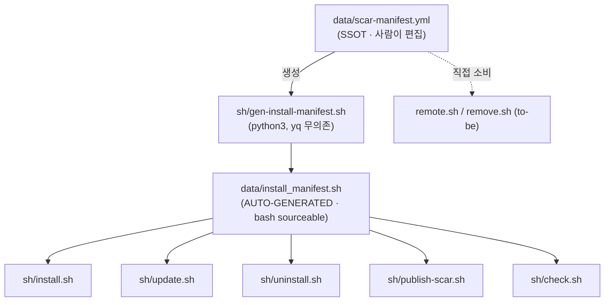

# 개요

`data/scar-manifest.yml` 은 fpm SCAR 가 다른 머신/서버로 배포되는 **두 경로**(플러그인·플랫파일)와
셸 부트스트랩 아티팩트를 한 곳에 모은 단일 진실 원본(SSOT)이다. 본 문서는 그 yml 의 설계 근거,
해결한 버그, 소비 스크립트 계약, 생성 절차를 기술한다. (Issue240)

# 해결한 버그 — 원격 플랫파일 삭제 누락

원격 서버 배포 경로(`data/claude_forNewServer/` → 원격 `~/.claude/`)의 rsync 설치 가이드가
과거 `--delete` 플래그를 쓰지 않았다. rsync 는 기본적으로 **추가·갱신만** 하고 소스에 없는
파일은 건드리지 않으므로, 소스에서 rename·삭제된 SCAR 파일이 원격 서버에 orphan 으로 잔존했다.
이것이 "다른 서버에 SCAR 를 설치/제거/업데이트하는데 해당 파일을 지우지 못하는 현상" 의 근원이다.

해법:

* `payloads.flat_file.rsync_delete: true` — orphan prune 활성
* `payloads.flat_file.protect[]` — `--delete` 시에도 보존할 대상 서버 사용자 데이터(Issue.md·projects/ 등)
* `payloads.flat_file.files[]` — 정밀 삭제·dry-run·검증용 전체 인벤토리

# 배포 2경로

| 경로            | 소스                      | 대상                 | 삭제 의미                                                  |
| :-------------- | :------------------------ | :------------------- | :--------------------------------------------------------- |
| 플러그인        | `plugins/fpm-core/`       | 마켓 → `claude plugin` | `plugin (un)install/update` 가 디렉토리 전체 교체 → orphan 자동 정리(문제 없음) |
| 플랫파일        | `data/claude_forNewServer/` | 원격 `~/.claude/`    | rsync `--delete` 필수 — 미사용 시 orphan 잔존(=원 버그)     |

플러그인 경로는 로컬 머신 표준 설치, 플랫파일 경로는 claude CLI 플러그인이 가용하지 않은
고객/타 서버용이다.

# SSOT 위계 — yml 이 정본, install_manifest.sh 는 파생

* **왜 파생물을 두는가**: installer 는 `yq`·`pyyaml` 무의존이어야 한다(폐쇄망·최소 환경). 따라서
  빌드 타임에 생성기가 yml → bash 투영을 만들어 커밋하고, 설치 시점엔 그 `.sh` 만 source 한다.
* **생성기**: `sh/gen-install-manifest.sh` (python3 + pyyaml, dev 머신에서만 실행)
* **drift 가드**: `bash sh/gen-install-manifest.sh --check` — yml 과 `.sh` 불일치 시 exit 2
* **편집 규칙**: `install_manifest.sh` 를 **직접 고치지 말 것**. yml 수정 → 생성기 재실행 → 커밋.

# 소비 스크립트 계약

| 스크립트                  | 읽는 영역                  | 비고                                            |
| :------------------------ | :------------------------- | :---------------------------------------------- |
| `sh/install.sh`           | shell + payloads.plugin    | 셸 부트스트랩 + 플러그인 멱등 설치              |
| `sh/update.sh`            | payloads.plugin            | git pull(셸) + marketplace/plugin update        |
| `sh/uninstall.sh`         | shell + payloads.plugin    | 셸 블록 제거 + plugin uninstall (마켓 보존)     |
| `sh/publish-scar.sh`      | payloads.plugin            | 소스 → 마켓 발행(rsync --delete)                |
| `sh/check.sh`             | shell + payloads.plugin    | 설치 검증 + SCAR drift 대조                     |
| `remote.sh` (to-be)       | payloads.flat_file         | 원격 `~/.claude` 플랫파일 배포(rsync_delete + protect) |
| `remove.sh` (to-be)       | payloads.flat_file         | `flat_file.files` 정밀 삭제, `protect` 보존     |

플러그인 경로 스크립트는 `data/install_manifest.sh`(파생) 를 source 한다(무의존). to-be 스크립트는
플랫파일 페이로드가 필요하므로 yml 을 직접 소비한다(dev/원격 모두 python3 또는 yq 가용 전제).

# remote.sh / remove.sh 소비 규약 (to-be)

본 이슈 범위 외(미구현)지만, 추후 구현자가 따를 계약을 명문화한다.

* `remote.sh`:
    - `payloads.flat_file.src_rel_repo` → 원격 `~/payloads.flat_file.dest_rel_home`
    - `rsync_delete: true` → `rsync --delete`
    - `protect[]` → `--exclude` 패턴(대상 서버 사용자 데이터 보존)
    - 항상 dry-run(`-n`) 먼저 → 지워질 orphan 확인 후 실제 실행
* `remove.sh`:
    - `flat_file.files[]` 를 `dest_rel_home` 기준으로 정밀 삭제
    - `protect[]` 매칭 경로는 skip
    - 삭제 전 백업(`_doc_work/z_done/` 또는 사용자 지정) 권장

# 변경 이력 기준

* 2026-06-29 Issue240 신설 — 플랫파일 삭제 누락 버그 수정 + 통합 SSOT 정립.
  결정(폼 회수): 페이로드 범위=둘 다 통합, 기존 install_manifest.sh 관계=yml 이 SSOT(파생).
* SCAR 추가·삭제·rename 시: yml 의 해당 페이로드 목록 갱신 → `bash sh/gen-install-manifest.sh` 재실행.
